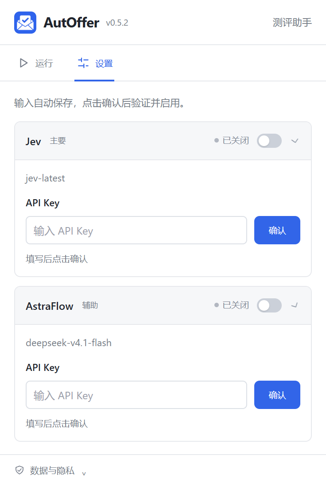
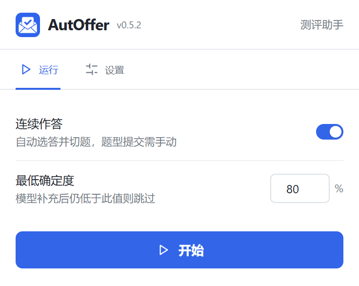

# AutOffer

## 0.5.2 AstraFlow 实际接口兼容

补齐固定星图域名的主机权限。`deepseek-v4.1-flash` 正式答题关闭默认思考，避免输出额度全耗在推理而没有最终 JSON；其他模型保持原有参数。提示要求说明缺失条件，不默默更改点名或补造图形。更新后请在扩展管理页重新加载，确保后台脚本切换到新版。

## 0.5.1 问卷星适配

新增问卷星 `/vm/` 移动答题页适配（实验性）：识别单选、多选、填空和简答。同页多题在悬浮面板选择当前题，客观题验证选中后自动推进；填空和简答显示参考答案，手动填写后点面板中的「下一题」。姓名、部门等基本信息不自动填写，不自动提交问卷。

已在真实问卷星页面使用 Jev 和 AstraFlow 验证识题、前四道单选自动选答、填空参考答案及报告导出，并完成浏览器页面录屏。多选仍为离线样例验证，使用时需配置自己的 Key。[支持范围与验收记录](src/platforms/wjx/README.md)。

一个按平台识别网页题目的开源 Chrome 扩展。支持 **Jev 和 AstraFlow**，用户自带 API Key，在网页悬浮球查看进度与运行日志。

项目从零实现。采用 TypeScript、Chrome Manifest V3 和声明式平台模板，优先让社区贡献者可以独立维护一个平台。

## 使用说明

**本项目仅供学习交流与技术研究**，用于了解 Chrome 扩展开发、网页题目识别和模型接口接入。请在自建样例、获授权的练习或允许辅助的模拟测评中使用。

- 请遵守目标平台规则，不要用于作弊、代考、绕过监考或未经授权的数据采集。
- 模型生成的答案、代码和确定度仅供参考，不保证正确性，请自行核对。
- 使用自己的 API Key，并自行确认模型服务的费用与数据处理政策；请勿公开凭据、个人信息或未获授权的题目内容。
- 项目与所适配的测评平台无隶属或背书关系。

以上为项目用途说明与使用倡议；代码采用 [MIT 协议](LICENSE)，授权范围及免责声明以协议正文为准。

## 当前进度

**当前状态：双模型路由 + 自编演示平台 + 牛客企业笔试适配（实验性）。** 牛客模板基于用户授权测试场次的真实单选 DOM，实现开放 Shadow DOM 的题干和选项读取；已在真实不定项页面验证题型标签、计分提示、多选同时选中和独立取消。判断题同布局映射有合成样例，尚未现场验证。前程无忧、北森尚未适配。Jev 接口已实现并通过模拟响应测试，真实调用和中文题目准确率需单独验证。

## 本地运行

构建要求 Node.js ≥ 22.18 和 npm；插件运行只需要 Chrome ≥ 116，**不需要启动任何本地或远程服务**。

```sh
npm ci
npm run build
```

1. 打开 `chrome://extensions`，启用「开发者模式」。
2. 点击「加载已解压的扩展程序」，选择项目下的 `dist/`。
3. 开发验收时可另运行 `npm run demo`，打开 <http://127.0.0.1:4173/demo.html> 测试识题；这只是本仓库的 HTML 测试样例。
4. 点击工具栏中的 AutOffer 图标，打开「设置」，在 Jev 或 AstraFlow 卡片中填写 Key，然后点击输入框右侧「确认」验证并启用。两组凭据独立保存。
5. 点击「开始」后可关闭弹窗。新题会自动识别和解析并产生模型用量；勾选连续作答后持续识别，题型末尾仍保持运行。

### 界面预览

在「设置」中展开 Jev 和 AstraFlow（UCloud 星图）卡片，填写自己的 API Key，再点击对应的「确认」完成验证。下面是插件真实界面截图，输入框为空，不包含密钥。



验证并启用模型后，切换到「运行」，按需设置连续作答和最低确定度，再在支持的练习页面点击「开始」。截图展示启动前的控制界面。



### 模型设置

Jev 和 AstraFlow 各有一张卡片，只需填写自己的 API Key。输入框右侧点击「确认」（或按回车），会保存、发送一次最小验证请求，验证成功后自动启用。输入草稿自动保存，不会仅因输入而调用模型。验证失败只在对应卡片显示一条提示；关闭弹窗后仍保留结果。

- **Jev**：固定使用 TypeSafe 官方接口 `https://api.typesafe.ai/v1/systemone` 和 `jev-latest`，无需选择渠道或填写模型。
- **AstraFlow**：固定使用 `https://api.modelverse.cn/v1` 和 `deepseek-v4.1-flash`，通过 Chat Completions 调用。验证和正式答题均关闭该 Flash 模型的思考模式，避免推理耗尽输出额度而没有 JSON 答案。验证最多输出 64 token，正式选择题 2048、文字参考答案 4096 token。其他模型的思考参数保持原有行为。
- 卡片标题行保留启用开关，可随时关闭，也可手动打开重新验证。验证期间可关闭开关取消；修改 Key 后需要再次确认。没有删除 Key 按钮，重新输入即可替换。
- Key 按目的地址隔离，仅在本机保存。「数据与隐私」展示接口地址。默认不发送题目图片。

### 双模型自动路由与报告（0.3.0）

题型与模态分别识别：单选、多选、判断都可能包含图片。平台适配器负责 DOM 提取、题型标签、材料、选项和图像区域；模型路由不依赖平台选择器。

| 题目 / 结果                        | 路由                                                                       |
| ---------------------------------- | -------------------------------------------------------------------------- |
| 纯文字单选、多选、判断             | 优先 Jev                                                                   |
| Jev 未配置、失败、超时或确定度不足 | 已配置的 AstraFlow，最多回退一次                                           |
| 图片、图形或公式                   | 直接走启用视觉能力的通用模型                                               |
| 主观、填空及未适配的编程布局       | 通用模型生成参考答案，手动填写                                             |
| 牛客 ACM                           | 生成当前语言代码、回填、自测、单题提交并读取判题结果（真实写入链路待验收） |
| 最终结果低于阈值                   | 不改选项，跳到下一题                                                       |

Jev 单次请求最多 15 秒，通用模型最多 60 秒，整次处理最多 90 秒。超时/失败回退可能产生两个供应商的用量。未知置信度保留人工复核，不当作高置信度。

视觉模型使用 Chat Completions 的 `image_url` 数据输入。每题最多 6 个完整可见的图像区域、编码前总计 4 MB；未加载、遮挡、超出视口或截取时位置变化会停止。音视频及无法定位图像的布局尚不支持；不自动滚动拼接。图片选择题的原生扩展截取和真实模型链路仍待验收。

扩展卡片只保留一个控制按钮：未运行时为「开始」，开始后变成「结束」。点击结束停止当前会话，后台生成 Markdown 报告并自动保存到浏览器默认下载文件夹（通常是系统“下载”），无需另点导出。弹窗关闭不影响下载；下载失败时保留报告，并显示「重试下载」。报告包含题目、参考答案、状态、模型路线、确定度与耗时，不含 Key、完整考试 URL 或图片。最多保留最近 300 题。

报告只覆盖本轮实际识别的题目，不代表整份试卷已完成或答案已提交。完整观察本题型从第 1 题起的全部题目、全部已答且没有跳过时，可点击明确的「下一题型」入口。牛客「提交本题型」及后续确认尚未适配，仍需手动处理；切换后会自动识别，不需要点继续。

### 悬浮球自动模式（实验性）

点击工具栏图标打开浏览器弹窗，包含「运行」和「设置」。切换网页会关闭弹窗，已输入的配置自动保存，重新打开即可继续。验证状态和失败原因由后台保存，切回弹窗或重新打开仍可查看；同一失败只在对应模型卡片显示一次。点击「开始」后，关闭弹窗不影响已开始的会话，无需手动重新识别。悬浮球可拖动、展开和收起，只展示进度、当前动作与最近 60 条日志；开始和结束统一在扩展卡片操作。

- 悬浮面板展示已答/跳过数量和运行日志，详细题目、答案与跳过原因保留在结束时自动下载的报告中。
- 网页内持续观察唯一可见题目，等待稳定后自动解析；相同题目去重并复用内存结果。模型请求/选答时外圈旋转，没有伪造百分比进度。
- 勾选自动选答后，验证实际选中状态再点击下一题，持续到当前题型末题，没有 5 题上限。
- 置信度低于设置阈值时不选择或更改选项，直接跳到下一题；末题低置信度则不选答、不自动跨题型，但继续识别页面变化。展示已答和跳过计数。
- Jev 多选使用独立选项概率：每个“选/不选”的概率均达到设置阈值才作答，不将它伪装成整题置信度；任一项不确定或答案集合为空时先尝试通用模型，最终仍低于阈值才跳过。
- 同布局的问答、简答、填空和编程题转通用模型生成参考答案并等待手动填写；图片选择题在启用视觉能力后走通用模型。缺少匹配模型的题跳过；单题错误保持识别，未知置信度保留复核，页面恢复或切题后自动处理。不自动提交题型或交卷。牛客 ACM 单题代码有单独的自测、保存提交流程。
- 取消、页面隐藏、切题后的旧响应都有隔离。悬浮球跟随 fullscreen 元素并优先使用浏览器顶层显示；不修改平台全屏或监测规则。
- SPA 翻题自动接续；整页刷新/导航更换文档后需从配置重新启用。主文档授权保存在扩展 session 存储，后台 service worker 休眠重启不会使同一文档突然失效。

实际场次已验证单选 DOM 选中状态、隐藏旧题及末题提交入口。自动切题解析、隐藏恢复和旋转动画通过本地模拟网页验证；连续 15 题、低置信度跳过和末题停止通过离线回归。真实 TypeSafe 驱动的完整自动流程仍待实测。

## 功能范围

| 能力                           | 状态                                        |
| ------------------------------ | ------------------------------------------- |
| 平台域名 + 路径 + DOM 标记匹配 | 已实现，冲突时停止匹配                      |
| 单选、多选、共享材料提取       | 已实现，演示样例测试                        |
| 图片、自由文本题               | 通用模型图像输入 / 参考答案，待真实模型验收 |
| 个人倾向题                     | 不生成答案，按真实情况手动作答              |
| Jev 单选 / 多选建议            | `Choice` / 每选项 `Noul`，真实接口待实测    |
| 双模型 Key、阈值和本轮报告     | 本机扩展存储                                |
| 超时、停止、页面变化校验       | 已实现                                      |
| 牛客一键选答案并下一题         | 自动持续到末题，低置信度跳过                |
| 自动提交题型 / 交卷            | 不执行                                      |
| AstraFlow                      | 已实现，仅需 Key，启用时申请网站授权        |
| 开放 Shadow DOM 富文本         | 模板可按需启用，牛客模板已使用              |
| iframe / 封闭 Shadow DOM / OCR | 尚未实现                                    |

Jev 当前只支持文本，不生成解析；精确计算和复杂推理有已知限制。置信度不是校招题目上的实测正确率。参见 [官方模型说明](https://docs.typesafe.ai/models)、[已知限制](https://docs.typesafe.ai/model-jaggedness/jev-1.13)。

## 架构

```text
配置弹窗 / 悬浮球 → 经过校验的消息 → 后台 Controller → 路由器 → Jev / Chat Provider
                                ↓
                        当前标签页的隔离脚本
                                ↓
                     平台 Registry → Template → Question
```

```text
src/
  core/          # 题目 / 建议结构、运行时校验、消息协议
  platforms/     # 一个目录一个平台；匹配与提取不依赖模型
    demo/        # 演示模板
    template.ts  # 通用声明式选择器引擎
    runtime.ts   # 通用动作分派、能力检查与旧题校验
    registry.ts  # 显式注册，便于审查支持范围
  solvers/       # 按领域和题型选择求解模式、维护共享提示
  providers/     # AnswerProvider、Jev、Chat Completions 与渠道路由
  background/    # Key、扫描快照、请求取消、页面变化检查
  content/       # 按需识题入口与全屏答题工具
  ui/            # 工具栏配置弹窗
tests/fixtures/  # 脱敏 HTML，是平台维护的回归依据
scripts/         # 构建、演示服务器、平台脚手架
docs/            # 架构、平台接入、隐私与验收
```

## 框架扩展

题目按三个独立维度描述：**领域**（专业测试 / 行测 / 心理相关 / 未知）、**形式**（单选 / 多选 / 判断 / 填空 / 主观 / 编程 / 量表 / 排序）和**作答意图**（知识题 / 个人倾向 / 未确认）。图片模态单独处理。量表、排序目前只可分类记录，尚未实现通用求解；个人倾向题仍手动作答。

平台统一注册只读提取器和可选动作；新增平台可以先贡献识题，生成建议后等待手动作答。领域与题型策略集中在 `solvers/`，模型接口只负责协议和响应校验。牛客已经迁移到这套接口，现有模板保持兼容。

详见 [架构评估与后续计划](docs/architecture-review.md)、[题目分类与求解扩展](docs/question-model.md)。这次重构没有新增真实平台适配。

## 新增平台

```sh
npm run platform:new -- example "示例平台"
```

生成平台目录、HTML fixture 和测试。修改域名、路径、标记及选择器，在 `registry.ts` 显式注册，然后运行：

```sh
npm run format
npm run check
```

详见 [平台接入指南](docs/platforms.md)、[贡献指南](CONTRIBUTING.md)、[架构约定](docs/architecture.md)。新平台默认 `experimental`，完成实际页面验证后才可改为 `verified`。

## 隐私与权限

- `activeTab`：用户点击扩展后，临时读取当前页；不申请全站持久读取权限。
- `scripting`：按需注入识题脚本，使用隔离执行环境。
- `storage`：保存设置、验证结果及用户自己的 Key，仅允许可信扩展上下文读取。
- 固定主机权限包含 `https://api.typesafe.ai/*`、`https://api.modelverse.cn/*` 和 `https://ai-gateway.vercel.sh/*`；`https://*/*` 仅声明为可选权限范围，保存新渠道时只请求对应 API 网站。

没有项目后端、账号、分析埋点或远程模板。获取建议时，题干、关联材料和选项发送给所选渠道及其下游模型服务商；自定义接口发往用户保存的地址。扫描不会调用网络；题目和答案在本轮内存中保留；手动结束后的报告保存在扩展 session 存储，可导出 Markdown，浏览器重启后清除。启用视觉能力时，后台临时截取可见页，只向通用模型发送模板识别出的题目图像裁剪，不发送整页截图。

Key 存储不等于加密保管：`chrome.storage.local` 是本机持久存储，不是系统密钥链。请不要将 Key 写进源码、Issue 或截图。[完整隐私说明](docs/privacy.md)。

## 共同维护

CI 运行类型检查、离线测试、格式检查和构建，不使用真实 API Key。平台问题请附脱敏 fixture、预期提取结果及平台版本，避免上传真实候选人信息或完整考试链接。

## License

[MIT](LICENSE) · Copyright 2026 AutOffer contributors

## 0.4.0 界面

插件弹窗分为「运行」和「设置」。运行页展示连续作答开关及百分比阈值，模型路线与配置统一放在「设置」；修改运行参数后点开始应用。模型卡可展开编辑，未保存的更改标为「待保存」。数据目的地说明收在「数据与隐私」中。

悬浮球缩至 40px，状态环保留；面板将题目内容与固定操作栏分开，解析说明可折叠，跳过历史仍逐题保留。键盘可以用左右方向键切换页签。视觉参考 [Bitwarden 紧凑模式](https://bitwarden.com/en-gb/blog/bringing-intuitive-workflows-and-visual-updates-to-the-bitwarden-browser/)和 [uBlock Origin 弹窗结构](https://github.com/gorhill/uBlock/wiki/Quick-guide%3A-popup-user-interface)，使用本项目自己的样式与图标。

## 0.4.1 品牌与首页

品牌统一为 **AutOffer**。运行页只保留作答控制；Jev、OpenAI 兼容模型及其配置状态统一在「设置」查看。新图标用于浏览器工具栏、扩展管理页、弹窗和悬浮球，含 16/32/48/128px PNG。[图标原图与生成记录](assets/brand/README.md)。

## 0.5.0 运行操作

运行页底部只有「开始 / 结束」按钮，状态从已启用的页面读取。结束由后台生成并下载报告；重复点击或重新打开弹窗不会重复下载同一报告。下载未完成时可重试。悬浮球只展示日志与进度。

## 弹窗交互

当前入口为工具栏卡片弹窗（`popup.html`），不使用侧栏或独立设置页。点击扩展图标打开；上次使用的「运行 / 模型设置」页面会保留。配置自动保存，手动打开模型开关才验证；保存状态、启用状态和一次错误提示分开显示。验证在后台进行，即使关闭弹窗，回来后也能查看最后结果。若浏览器中断验证，会明确提示重新验证。

切换到另一道题所在的新网页后，请在该网页点击扩展图标，再开始。

## 主模型、辅助与持续运行

模型卡片标注 Jev「主模型」、AstraFlow「辅助」。运行页显示当前阈值下的回退规则：文字客观题先 Jev；低于阈值、需复核或失败时仅回退已启用的 AstraFlow 一次。最终低确定度跳过，未知确定度待复核，主观题直接 AstraFlow。

同一网页文档内，切换标签页、题型末尾和单题失败不会关闭运行状态。临时网络、超时和页面未稳定错误按 5/15/45 秒最多重试 3 次；之后仍观察新题，不重复扣费请求。点击结束可取消请求并保持停止。浏览器可能节流后台页面定时器，整页刷新后仍需重新授权并开始。

下载报告使用 `downloads` 权限，只创建本轮 Markdown 文件，不上传报告；文件名以 autoffer-report 开头，重名时自动改名。

### 牛客 ACM 作答进度

ACM 两道不计分例题仍自动略过，不请求模型、不计入已答或跳过。正式题先确认可见 Monaco 编辑器与语言，使用 AstraFlow 生成完整程序；回填并读回一致后自测，自测通过才点击「保存提交」。只认本次新增的运行记录，判题全部通过后计入已答，再尝试下一题；不点击「提交本题型」或交卷。

日志分别显示生成、回填、自测、单题提交与判题。编辑器无法唯一定位、被手动修改、切题、低确定度或运行失败时不会继续提交，代码与错误保留。没有新记录或判题超时不重复点击。此链路已覆盖离线回归；当前场次已结束，尚未验收真实页面的回填和单题提交。
