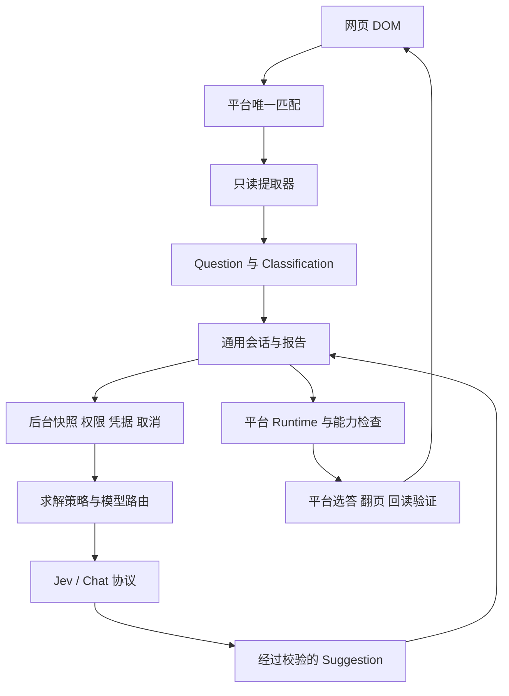

# 架构评估与本轮重构

评估日期：2026-09-23。基于当前 0.5.0 工作目录的源代码和离线测试；此目录没有 Git 元数据。此前只有牛客真实场景适配，另有自编 demo。

## 结论

保留纯 Chrome 扩展、TypeScript、Zod、声明式模板和后台凭据管理。当前规模不需要改成服务端系统、monorepo 或远程插件市场。主要工作是打通平台贡献边界，并把题目语义与交互形式分开。

原有生命周期处理值得保留：文档身份绑定、切题取消、旧响应丢弃、同题缓存、动作后回读选中状态、Key 隔离、超时回退和有界报告。这些比重新搭一个通用插件加载器更直接影响可靠性。

| 原有问题                                           | 后续贡献受到的影响                                                  | 本轮处理                                                                        |
| -------------------------------------------------- | ------------------------------------------------------------------- | ------------------------------------------------------------------------------- |
| content/tools.ts 直接导入牛客 actions              | 识题模板注册成功后，自动流程仍会进入牛客校验；新平台需要修改公共 UI | 平台注册可选 actions；统一 runtime 按匹配平台分派，识题平台也能单独运行建议模式 |
| kind 同时包含 single、multiple、text、personal     | 领域、形式和个人倾向混在一起；判断/填空/编程语义依赖中文标签        | classification 拆为 domain、format、intent，kind 保留为兼容投影                 |
| 求解提示写在供应商协议里                           | 添加领域策略时要改多个 HTTP Provider，难以复用                      | 提取纯函数 solvers/policy，两种 Provider 使用同一分类和提示                     |
| 自定义 Adapter 返回值未在 registry 统一校验        | 使用模板与自行写提取器时契约不一致                                  | registry 统一 ScanSchema 校验、平台身份和重复平台注册校验                       |
| 贡献文档称 platforms 不写页面，与已有 actions 冲突 | 维护者不知道动作应该放哪里                                          | 明确 extractor 只读、actions 可写、index 组合注册；补共用契约测试与脚手架       |

## 当前结构

实际模块组合：牛客 `index.ts` 组合 `extractor.ts` 与 `actions.ts`。提取器、动作不互相导入 index，避免循环依赖。平台冲突时没有优先级猜测。运行时每次动作重新验证当前题；具体遮挡、控件状态和翻页完成检查由平台 actions 实现。

新增贡献分三条路径：

1. 新平台或页面布局：平台目录、脱敏 fixture、提取契约测试、registry 注册；动作可以以后补。
2. 新领域或题目形式：classification 和 solvers、Provider 答案校验、组合测试；无需改平台选择器以外的 UI。
3. 新模型接口：Provider、渠道配置和权限、模拟响应测试；不访问页面 DOM。

## 后续优先级

| 优先级 | 工作                                          | 开始条件与验收                                                                                            |
| ------ | --------------------------------------------- | --------------------------------------------------------------------------------------------------------- |
| P1     | 接入第二个真实平台                            | 获得授权且脱敏的页面样例；先识题，再验证选答、取消、翻页和末题停止。用于验证目前扩展边界是否足够          |
| P1     | 建立领域 × 形式 × 模态的 fixture 和样例答案集 | 使用公开授权或自编内容，分开统计提取正确性与模型正确率；CI 不依赖真实 Key                                 |
| P2     | 拆分写入与导航结果                            | 当前 apply 保留选答并翻页，适合单题 SPA；批量答题、手动翻页的平台需要 applied/advanced/blocked 等更细结果 |
| P2     | 结构化答案                                    | 有真实多空、排序、匹配题样例后定义答案联合类型与控件绑定，避免拿 selectedIds/answerText 硬凑              |
| P2     | 多题页面调度                                  | 模板能提取多题，但自动会话仍要求唯一当前题；需要明确焦点、逐题状态、共享材料与导航顺序                    |
| P3     | iframe、OCR、复杂公式                         | 分别设计授权、frame/document 身份、图像定位和复核路径；不扩大全站权限解决局部问题                         |
| P3     | 会话进一步拆分                                | session.ts 仍集合缓存、状态机与报告；出现独立演进需求后拆出记录存储，不在本轮同时改写成熟取消逻辑         |

当前 Provider 路由仍固定 Jev + Chat 两个槽位。先保持用户设置和凭据迁移稳定；等第三种真正不同的协议出现再做 Provider 能力注册。类似地，solvers 当前是纯策略表，尚未引入外部插件执行或专用求解工具。

## 验证范围

本轮针对分类组合、未知意图、兼容旧题目、只读平台、第二个合成平台的动作分派、旧题/取消/无效答案拦截、报告分类、生成模板运行增加离线回归，并继续运行原有牛客、模型路由与会话测试。

合成第二平台证明代码扩展入口可用，不代表新增了真实平台支持。真实 Chrome 中的完整模型调用、心理问卷支持、题目正确率和跨题型运行仍需对应验收；本轮没有提交真实测评或调用付费模型。
